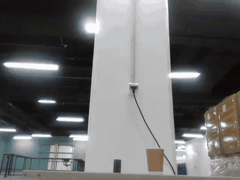

# LeRobot × Unitree Go2

Record Go2 camera frames, state and velocity commands in LeRobot Dataset v3.
Keyboard/gamepad teleoperation and an optional SO-101 arm bridge. No ROS required.

[](https://github.com/dancher00/lerobot-unitree-go2/actions/workflows/ci.yml)
[](https://huggingface.co/datasets/dancher00/go2_object_approach_v1)

## Real dataset

**[Go2 Object Approach](https://huggingface.co/datasets/dancher00/go2_object_approach_v1)** —
202 episodes · 48,889 frames · 20 Hz · RGB 640 × 480.
Task: approach the target object and stop in a manipulation-ready pose.



Episode 0, all 21 seconds shown at 2× speed. Actual recorded camera footage.

One real sample from this episode: **frame 100, t = 5.00 s** (values rounded):

| Field | Recorded values |
| --- | --- |
| `observation.state` | `[-0.0046, -0.2041, 0.0202, -0.0192, -0.0264, 1.3093]` |
| `action` | `[0.0, -0.3, 0.0]` |

State: `[vx, vy, wz, roll, pitch, yaw]`. Action: `[vx, vy, wz]` commands.
Units: m/s, rad/s, radians. Each sample also includes the front-camera image.

```python
from lerobot.datasets.lerobot_dataset import LeRobotDataset

dataset = LeRobotDataset("dancher00/go2_object_approach_v1", video_backend="pyav")
sample = dataset[100]  # The sample above, including observation.images.front
```

## Use it

- [Install, connect Go2 and record](docs/guide.md)
- [Go2 + SO-101: SSH bridge, two cameras and joint recording](docs/go2-so101.md)
- [Dataset schema, validation and limitations](docs/go2-object-approach.md)

The published dataset is Go2-only; it contains no arm actions or wrist video.
Code: [Apache-2.0](LICENSE). Dataset: CC BY 4.0.
