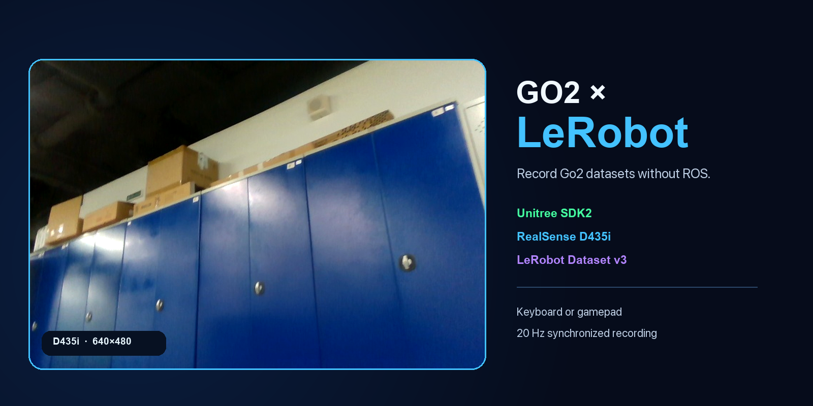
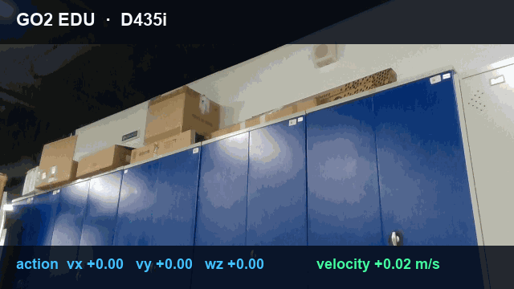

<div align="center">



# LeRobot × Unitree Go2

Open-source adapter for recording Go2 trajectories with Hugging Face LeRobot. No ROS required.

[](https://github.com/dancher00/lerobot-unitree-go2/actions/workflows/ci.yml)
[](LICENSE)
[](pyproject.toml)
[](https://huggingface.co/docs/lerobot)

[Install](#install) · [Record a dataset](#record-a-dataset) · [Full guide](docs/guide.md)

</div>

The adapter connects Unitree SDK2 to the current LeRobot robot API. Each sample contains a D435i
frame, body state, the velocity command sent to the robot, and the usual LeRobot metadata.

- Go2 and Go2 EDU
- Unitree SDK2 `SportClient`
- Intel RealSense D435i
- gamepad or keyboard control
- command limits, watchdog, emergency stop, and zero velocity on exit
- mock mode for tests and CI

## Demo

<div align="center">

<br>
<sub>Go2 EDU walking at 0.30 m/s. D435i frames and commands are recorded at 20 Hz.</sub>
</div>

Tested on a Go2 EDU with a D435i: stand-up, DDS state, velocity control, safe stop, 640×480 RGB,
and a 190-frame LeRobot Dataset v3 that loads with `LeRobotDataset`.

## Install

```bash
git clone https://github.com/dancher00/lerobot-unitree-go2.git
cd lerobot-unitree-go2
python3.12 -m venv .venv
source .venv/bin/activate
pip install -e '.[test,unitree,realsense,gamepad,keyboard]'
pytest -q
```

Find the camera and check the robot state without moving it:

```bash
lerobot-find-cameras realsense
python examples/read_go2_state.py --interface eth0
```

See the [full guide](docs/guide.md) for CycloneDDS, networking, and RealSense setup.

## Record a dataset

```bash
lerobot-go2-keyboard-record \
  --interface eth0 \
  --serial YOUR_CAMERA_SERIAL \
  --repo-id YOUR_NAME/go2_walk \
  --task 'Walk to the red object' \
  --episodes 10
```

The same command is available as `python examples/record_go2_keyboard.py`. During recording:

`W/S` forward · `A/D` lateral · `J/L` yaw · `Space` stop · `X` emergency stop · `U` reset

The default forward speed is 0.3 m/s. Use `--vx`, `--vy`, and `--wz` to change it. Add
`--push-to-hub` to upload the dataset after recording.

## Dataset

```text
observation.images.front   RGB, 640×480
observation.state          [vx, vy, wz, roll, pitch, yaw]
action                     [vx, vy, wz]
task · timestamp · episode_index · frame_index
```

```bash
lerobot-dataset-viz --repo-id YOUR_NAME/go2_walk --episode-index 0
hf auth login  # use --dataset.push_to_hub=true to upload while recording
```

## Safety

Clear the area and keep the Unitree remote stop within reach. Start with low velocity limits.
This is research software and is not a certified safety system.

<div align="center">

[Setup and troubleshooting](docs/guide.md) · [Examples](examples) · [Contributing](CONTRIBUTING.md)

If the project is useful to you, a star helps others find it.

Apache-2.0

</div>
